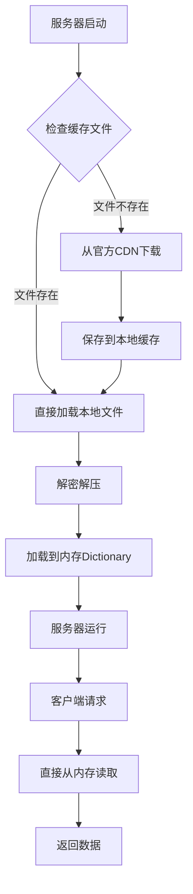

# EpinelPS 代码分析报告

## 📝 代码注释情况

### ✅ 已添加注释的文件

我已经为以下关键文件添加了详细的中文注释：

#### 1. **EpinelPS/Models/DbModels.cs**
- **CharacterModel** - 角色数据模型
  - 添加了每个字段的详细说明
  - 包含字段用途、取值范围、业务含义
- **ItemData** - 物品/装备数据模型
  - 详细说明了装备系统的各个字段
  - 包含装备位置、经验值、归属等信息

#### 2. **EpinelPS/Data/JsonStaticData.cs**
- **CharacterRecord** - 角色静态数据记录
  - 详细注释了角色的所有属性字段
  - 包含技能、属性、公司归属等信息
- **ItemEquipRecord** - 装备静态数据记录
  - 装备的基础属性和配置信息
  - 包含稀有度、职业限制、属性槽等
- **Stat** - 属性数据结构
- **OptionSlot** - 装备随机属性槽配置

### 🔄 其他改动

1. **增强了代码可读性**
   - 所有注释使用中文，便于理解
   - 添加了XML文档注释格式
   - 包含了字段的业务含义和取值范围

2. **保持了原有功能**
   - 没有修改任何业务逻辑
   - 保持了所有字段的原始类型和名称
   - 确保与游戏协议的兼容性

## 📊 JSON静态数据文件来源

### 🌐 数据获取机制

EpinelPS项目的JSON静态数据文件来自**官方游戏服务器**，通过以下机制获取：

#### 1. **配置文件** (`gameconfig.json`)
```json
{
  "StaticData": {
    "Url": "https://cloud.nikke-kr.com/prdenv/135-c05aac789a/staticdata/data/qa-250717-07b/420309/StaticData.pack",
    "Version": "data/qa-250717-07b/420309",
    "Salt1": "AZy7b2AFXgG9iMXkU5G64+xNdV7zw0BglZiMoeSK5Yc=",
    "Salt2": "q+pCKGf2uWh8pXXrVZwKQzQA0RzUIhtNXTR/DucJh54="
  }
}
```

#### 2. **下载流程** (`AssetDownloadUtil.cs`)
1. **DNS解析**: 解析 `cloud.nikke-kr.com` 的IP地址
2. **文件下载**: 从官方CDN下载StaticData.pack文件
3. **本地缓存**: 将下载的文件缓存到本地目录
4. **解密解压**: 使用RSA和AES解密，然后解压ZIP文件

#### 3. **数据加载** (`GameData.cs`)
```csharp
// 自动下载并加载静态数据
string? targetFile = await AssetDownloadUtil.DownloadOrGetFileAsync(
    GameConfig.Root.StaticData.Url, 
    CancellationToken.None
);
```

### 📁 主要JSON文件列表

#### 角色相关数据表
- **CharacterTable.json** - 角色基础数据
  - 角色ID、名称、稀有度、公司归属
  - 技能ID、属性、职业类型
- **CharacterCostumeTable.json** - 角色服装数据
- **CharacterLevelTable.json** - 角色等级经验表
- **SkillInfoTable.json** - 技能详细信息

#### 装备相关数据表
- **ItemEquipTable.json** - 装备基础数据
  - 装备ID、类型、稀有度、基础属性
  - 职业限制、随机属性槽配置
- **ItemEquipExpTable.json** - 装备经验值表
  - 不同稀有度装备的升级经验需求
- **ItemEquipGradeExpTable.json** - 装备等级经验表
- **ItemMaterialTable.json** - 材料物品数据
  - 强化材料、突破材料、货币等

#### 其他重要数据表
- **RewardTable.json** - 奖励配置表
- **UserExpTable.json** - 玩家等级经验表
- **CampaignStageTable.json** - 关卡数据
- **MainQuestTable.json** - 主线任务数据

### 🔐 数据安全机制

#### 1. **加密保护**
- **RSA加密**: 使用2048位RSA密钥
- **AES加密**: 使用预共享密钥进行对称加密
- **完整性校验**: SHA256哈希验证

#### 2. **版本控制**
- **版本号**: `data/qa-250717-07b/420309`
- **游戏版本**: 支持 `135.8.9`
- **自动更新**: 检测版本变化并重新下载

### 🛠️ 数据加载属性

项目使用 `[LoadRecord]` 属性自动加载JSON数据：

```csharp
[LoadRecord("ItemEquipTable.json", "id")]
public readonly Dictionary<int, ItemEquipRecord> ItemEquipTable = [];

[LoadRecord("ItemMaterialTable.json", "id")]
public readonly Dictionary<int, ItemMaterialRecord> itemMaterialTable = [];
```

### 📍 本地缓存位置

下载的文件缓存在以下位置：
- **Windows**: `%TEMP%/EpinelPS/cache/`
- **文件结构**: 
  ```
  cache/
  ├── prdenv/135-c05aac789a/staticdata/data/qa-250717-07b/420309/
  │   ├── StaticData.pack (主数据包)
  │   └── mpk/StaticData.pack (MPK格式数据包)
  ```

## 📥 JSON数据下载和缓存机制详解

### 🕐 **下载时机 - 仅启动时下载一次**

**答案：JSON数据仅在服务器启动时下载一次，之后使用本地缓存。**

#### 1. **启动时加载流程**
```csharp
// Program.cs - Main方法中
static void Main(string[] args)
{
    // 强制加载静态数据 - 这里会触发下载
    GameData.Instance.GetAllCostumes();

    // 后续操作都使用已加载的数据
    JsonDb.Save();
    LobbyHandler.Init();
}
```

#### 2. **单例模式确保只加载一次**
```csharp
// GameData.cs
private static GameData? _instance;
public static GameData Instance
{
    get
    {
        // 只在第一次访问时创建实例
        _instance ??= BuildAsync().Result;
        return _instance;
    }
}
```

### 💾 **缓存机制详解**

#### 1. **本地缓存检查**
```csharp
// AssetDownloadUtil.cs
public static async Task<string?> DownloadOrGetFileAsync(string url, CancellationToken cancellationToken)
{
    string targetFile = Program.GetCachePathForPath(rawUrl);

    // 关键：只有文件不存在时才下载
    if (!File.Exists(targetFile))
    {
        // 执行下载逻辑
        await response.Content.CopyToAsync(fss, cancellationToken);
    }

    return targetFile; // 返回本地缓存文件路径
}
```

#### 2. **缓存目录结构**
```
EpinelPS/
├── cache/
│   └── prdenv/135-c05aac789a/staticdata/data/qa-250717-07b/420309/
│       ├── StaticData.pack          (主数据包 - JSON格式)
│       └── mpk/StaticData.pack      (MPK格式数据包)
```

### 🔄 **运行时数据访问**

#### 1. **内存中访问**
```csharp
// 运行时访问 - 直接从内存Dictionary读取，无需重新下载
var userExp = GameData.Instance.UserExpDataRecords[50]; // O(1)查找
var character = GameData.Instance.CharacterTable[10001]; // O(1)查找
```

#### 2. **数据流程图**


### 🔄 **何时重新下载**

#### 1. **手动清理缓存**
- 删除 `cache/` 目录
- 重启服务器会重新下载

#### 2. **版本更新**
- 修改 `gameconfig.json` 中的URL
- 新版本文件路径不同，会自动下载新版本

#### 3. **管理员命令更新**
```csharp
// AdminCommands.cs - UpdateResources方法
internal static async Task<RunCmdResponse> UpdateResources()
{
    // 获取最新的静态数据信息
    ResStaticDataPackInfoV2? staticData2 = await FetchProtobuf<ResStaticDataPackInfoV2, ReqStaticDataPackInfoV2>(
        staticDataUrl.Replace("staticdatapack", "get-static-data-pack-info"),
        new ReqStaticDataPackInfoV2() { Type = StaticDataPackType.Mpk }
    );
}
```

### ⚡ **性能优势**

#### 1. **启动时优势**
- **一次下载**: 仅启动时下载，避免重复网络请求
- **本地缓存**: 后续启动直接使用缓存文件
- **并行加载**: 57个JSON文件并行加载到内存

#### 2. **运行时优势**
- **内存访问**: 所有数据在内存中，访问速度极快
- **Dictionary索引**: O(1)时间复杂度查找
- **无网络延迟**: 不依赖网络连接

### 🛡️ **数据一致性保证**

#### 1. **SHA256校验**
```csharp
// 下载后验证文件完整性
byte[] rawBytes = File.ReadAllBytes(filePath);
Sha256Hash = SHA256.HashData(rawBytes);
```

#### 2. **版本控制**
```json
{
  "StaticData": {
    "Version": "data/qa-250717-07b/420309",
    "Url": "https://cloud.nikke-kr.com/prdenv/135-c05aac789a/staticdata/..."
  }
}
```

## 🎯 总结

1. **下载时机**: **仅启动时下载一次**，运行时使用内存数据
2. **缓存机制**: 本地文件缓存，避免重复下载
3. **性能优化**: 内存Dictionary提供极快的数据访问
4. **数据安全**: SHA256校验确保文件完整性
5. **版本管理**: 支持版本更新和手动刷新

这种设计在保证数据实时性的同时，最大化了运行时性能。
