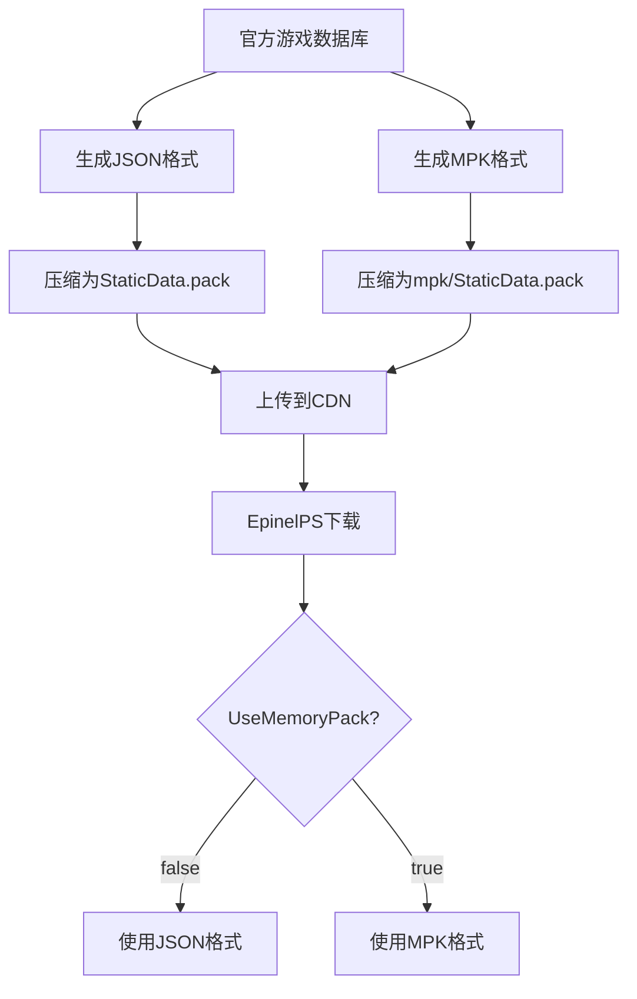

# StaticData.pack 文件格式分析

## 📦 两种数据格式详解

您说得完全正确！EpinelPS项目中确实有两个不同格式的StaticData.pack文件：

### 1. **JSON格式** - `StaticData.pack`
- **位置**: `cache/prdenv/.../StaticData.pack`
- **内容**: ZIP压缩包，包含JSON格式的游戏数据表
- **用途**: 开发和调试友好的文本格式

### 2. **MPK格式** - `mpk/StaticData.pack`
- **位置**: `cache/prdenv/.../mpk/StaticData.pack`
- **内容**: ZIP压缩包，包含MemoryPack二进制格式的数据
- **用途**: 生产环境优化的二进制格式

## 🔄 格式选择机制

### 配置控制
```csharp
// GameData.cs
private bool UseMemoryPack = false; // 当前设置为使用JSON格式
```

### 动态切换逻辑
```csharp
// 构造函数中的格式选择
if (UseMemoryPack)
    LoadGameData(mpkFilePath, GameConfig.Root.StaticDataMpk);  // 使用MPK格式
else
    LoadGameData(filePath, GameConfig.Root.StaticData);       // 使用JSON格式
```

## 📄 JSON格式详解

### 文件结构
```
StaticData.pack (ZIP文件)
├── CharacterTable.json
├── ItemEquipTable.json
├── UserExpTable.json
├── SkillInfoTable.json
└── ... (57个JSON文件)
```

### JSON文件内容格式
```json
{
  "version": "data/qa-250717-07b/420309",
  "records": [
    {
      "id": 10001,
      "name_code": 1001,
      "original_rare": "SSR",
      "corporation": "Elysion",
      "character_class": "Attacker",
      "critical_ratio": 500,
      "critical_damage": 2000,
      "ulti_skill_id": 100101,
      "skill1_id": 100102,
      "skill2_id": 100103
    },
    // ... 更多记录
  ]
}
```

### 加载过程
```csharp
// JSON格式的反序列化
DataTable<X> obj = await JsonSerializer.DeserializeAsync<DataTable<X>>(
    MainZip.GetInputStream(fileEntry), 
    JsonDb.IndentedJson
);
deserializedObject = [.. obj.records];
```

## 🔢 MPK格式详解

### 文件结构
```
mpk/StaticData.pack (ZIP文件)
├── CharacterTable.mpk
├── ItemEquipTable.mpk
├── UserExpTable.mpk
├── SkillInfoTable.mpk
└── ... (57个MPK文件)
```

### MPK文件特点
- **二进制格式**: 使用MemoryPack序列化
- **高性能**: 反序列化速度比JSON快数倍
- **体积小**: 二进制格式占用空间更少
- **类型安全**: 强类型序列化，避免类型转换错误

### 加载过程
```csharp
// 文件名转换：.json -> .mpk
if (UseMemoryPack) entry = entry.Replace(".json", ".mpk");

// MPK格式的反序列化
Stream stream = MainZip.GetInputStream(fileEntry);
deserializedObject = await MemoryPackSerializer.DeserializeAsync<X[]>(stream);
```

## ⚙️ 数据结构对比

### JSON格式数据结构
```csharp
public class DataTable<T>
{
    public string version { get; set; } = "";    // 版本信息
    public List<T> records { get; set; } = [];   // 数据记录数组
}
```

### MPK格式数据结构
```csharp
// 直接序列化为强类型数组，无需包装类
[MemoryPackable]
public partial class CharacterRecord
{
    public int id;
    public string original_rare = "";
    // ... 其他字段
}
```

## 🔄 格式转换流程

### 官方数据处理流程


## 📊 性能对比

### JSON格式
**优点**:
- ✅ 人类可读，便于调试
- ✅ 跨平台兼容性好
- ✅ 可以手动编辑和验证
- ✅ 工具支持丰富

**缺点**:
- ❌ 文件体积较大
- ❌ 解析速度较慢
- ❌ 内存占用较高

### MPK格式
**优点**:
- ✅ 解析速度极快（比JSON快3-5倍）
- ✅ 文件体积小（比JSON小30-50%）
- ✅ 内存效率高
- ✅ 强类型安全

**缺点**:
- ❌ 二进制格式，不可读
- ❌ 调试困难
- ❌ 需要特定工具查看内容

## 🛠️ 开发建议

### 当前配置分析
```csharp
// 当前设置为false，使用JSON格式
private bool UseMemoryPack = false;

// 注释说明未来计划
// TODO: all of the data types need to be changed to match the game
```

### 使用场景建议

#### 开发环境 - 推荐JSON格式
```csharp
private bool UseMemoryPack = false;
```
- 便于调试和数据验证
- 可以手动修改测试数据
- 错误信息更清晰

#### 生产环境 - 推荐MPK格式
```csharp
private bool UseMemoryPack = true;
```
- 启动速度更快
- 内存占用更少
- 运行性能更好

## 🔧 配置切换方法

### 1. 修改代码
```csharp
// 在GameData.cs中修改
private bool UseMemoryPack = true; // 改为true使用MPK格式
```

### 2. 清理缓存
```bash
# 删除缓存目录，强制重新下载
rm -rf cache/
```

### 3. 重启服务器
- 服务器会自动下载对应格式的数据包
- 根据UseMemoryPack设置选择加载方式

## 🎯 总结

1. **两种格式**: JSON（文本）和MPK（二进制）
2. **自动选择**: 根据UseMemoryPack标志自动选择格式
3. **性能差异**: MPK格式在速度和体积上都有优势
4. **开发友好**: JSON格式便于调试和开发
5. **生产优化**: MPK格式适合生产环境部署

当前项目使用JSON格式，这对开发和调试非常友好。如果需要优化性能，可以考虑切换到MPK格式。
